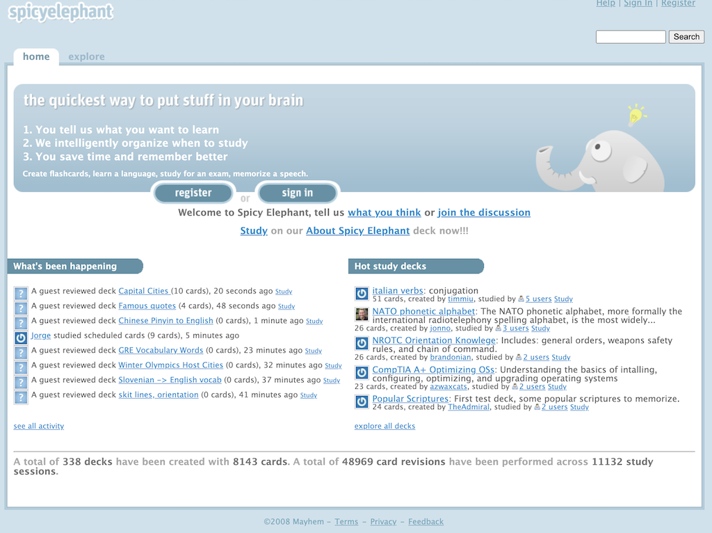

# Spicy Elephant Archive

This repository provides an archive of the Spicy Elephant project hosted at `SpicyElephant.com` circa 2008.

The website was shutdown in 2009.

## About

Spicy Elephant was a website that allowed users to sign-up and learn topics using [spaced repetition](https://en.wikipedia.org/wiki/Spaced_repetition).

Users created their own decks of flash cards which by default where shared publicly. A paid account could be created to allow the user to keep their flash cards private.

The tag line was:

* Spicy Elephant: the quickest way to put stuff in your brain

The website was developed by _Mayhem Method_ which included: Jason Brownlee, Craig Baker, Cameron Taylor, and Mateja "Matt" Milosavljevic.

**Image:**

**Screenshot:**

## Code

The website was developed using Ruby on Rails.

A snapshot of the code is provided:

* [src/](src/)

The snapshot includes user management, flash card deck management and the spaced repetition.

A dump of the database is not included.

## Sources

* [http://SpicyElephant.com](https://web.archive.org/web/20080917164533/http://spicyelephant.com/) (archived)
* [http://groups.google.com/group/spicy-elephant](https://web.archive.org/web/20080905115412/http://groups.google.com/group/spicy-elephant) (archived)
* [Hacker News Launch](https://news.ycombinator.com/item?id=262627)
* [Hacker News Recap](https://news.ycombinator.com/item?id=265452)
* [My experiences on a one month startup: SpicyElephant.com](https://web.archive.org/web/20080806040351/http://www.neverreadpassively.com/2008/08/my-experiences-on-one-month-startup.html) (archived)